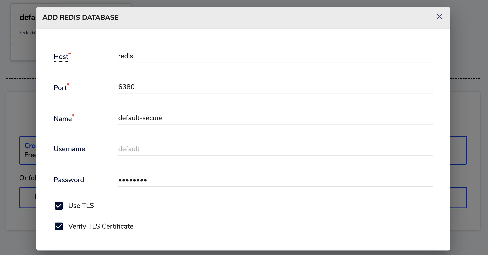
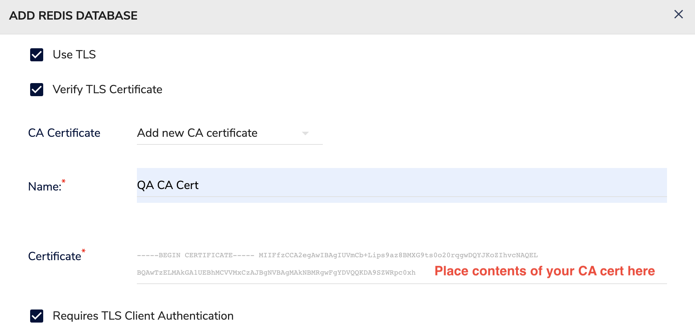
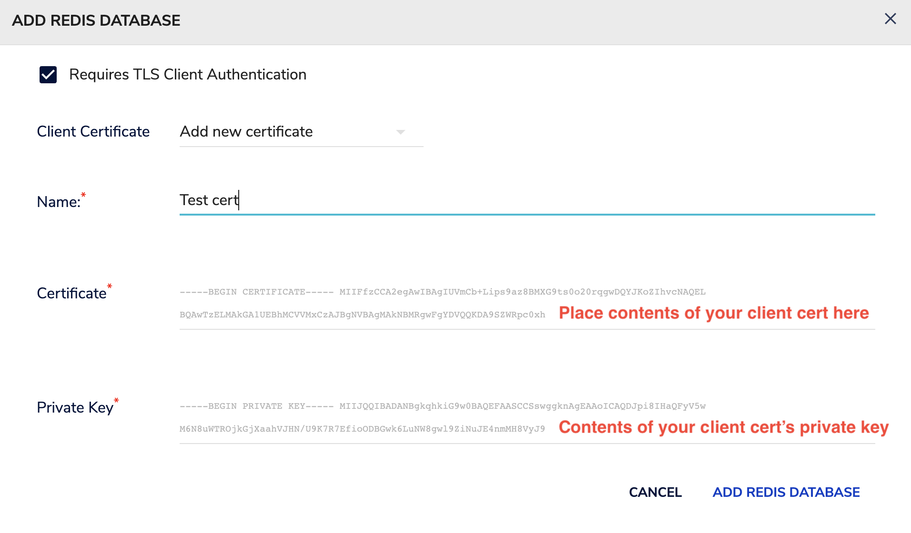

# local-stack
Config and utils to manage runtime dependencies for local development

To instantiate the main stack:
```
docker compose up
```

Components pre-configured as part of main stack include:
* [MongoDB](https://www.mongodb.com/docs/manual/)
  * Endpoint @ localhost:27017
* [Mongo Express](https://github.com/mongo-express/mongo-express)
  * http://localhost:8881/
* [Kafka](https://kafka.apache.org/)
  * Endpoint @ localhost:29092
* [Redpanda Console for Kafka](https://redpanda.com/redpanda-console-kafka-ui)
  * http://localhost:8880/overview
* [Redis](https://redis.io/)
  * Endpoint @ localhost:6379
* [Redis Insight](https://redis.io/insight/)
  * http://localhost:5540/
* [Zipkin](https://zipkin.io/pages/quickstart.html)
  * http://localhost:9411

## Optional components
### PostgreSQL and pgAdmin
To add [PostgreSQL](https://www.postgresql.org/) and [pgAdmin](https://www.pgadmin.org/) to the stack:
```
docker compose -f docker-postgres-compose.yaml up
```
* PostgreSQL Endpoint @ localhost:15432
* pgAdmin Endpoint @ http://localhost:15433/
  * login:  `me@local.org`,  password:  `password`

### Azurite

[Azurite](https://learn.microsoft.com/en-us/azure/storage/common/storage-use-azurite?tabs=docker-hub) is an open-source emulator for Azure Blob, Queue Storage, and Table Storage APIs.  To add Azurite to the stack:
```
docker compose -f docker-azure-compose.yaml up
```

### AWS LocalStack

[LocalStack](https://github.com/localstack/localstack) is an open-source emulator for AWS.  To add LocalStack to the stack:
```
docker compose -f docker-aws-compose.yaml up
```

## Redis
To configure TLS locally, use [gen-test-certs.sh](gen-test-certs.sh) to generate self-signed certificates.
The latest version of this script can be found in [Redis' repo](https://github.com/redis/redis/blob/unstable/utils/gen-test-certs.sh)

### Using RedisInsight to connect to a TLS-enabled Redis instance


Notice that because RedisInsight is running inside the same container network as Redis, `redis` is used as the hostname instead of localhost.




