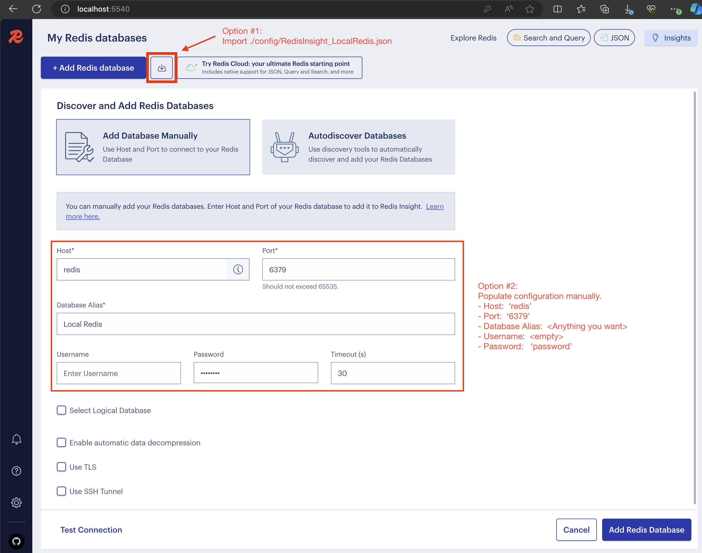

# local-stack
Config and utils to manage runtime dependencies for local development

To instantiate the main stack:
```
docker compose up
```

Components pre-configured as part of main stack include:
* [MongoDB](https://www.mongodb.com/docs/manual/)
  * Endpoint @ `localhost:27017`
* [Mongo Express](https://github.com/mongo-express/mongo-express)
  * http://localhost:8881/
* [Kafka](https://kafka.apache.org/)
  * Endpoint @ `localhost:29092`
* [Redpanda Console for Kafka](https://redpanda.com/redpanda-console-kafka-ui)
  * http://localhost:8880/overview
* [Redis](https://redis.io/)
  * Endpoint @ `localhost:6379`
* [Redis Insight](https://redis.io/insight/)
  * http://localhost:5540/
* [PostgreSQL](https://www.postgresql.org/)
  * Endpoint @ `localhost:15432`
* [pgAdmin](https://www.pgadmin.org/) (PostgreSQL admin tool)
  * http://localhost:15433/
  * login:  `me@local.org`,  password:  `password`
  
The main stack consumes ~1.3GB of memory:


By default, Docker Desktop is set to use up to 50% of your host's memory.  A machine with 32GB RAM should have plenty of available memory to comfortably run the main stack.  On less equipped machines, you may need to adjust how much resources you want to allocate to Docker to run both the main stack and your applications.

## Optional components

### OpenTelemetry and Observability
To add OpenTelemetry Collector and tools to support observability (o11y):
```
docker compose -f docker-o11y-compose.yaml up
```
* [OpenTelemetry Collector](https://opentelemetry.io/docs/collector/)
  * OTLP gRPC receiver:  `localhost:4317`
  * OTLP HTTP receiver:  `localhost:4318`
  * See [OTLP Exporter Configuration](https://opentelemetry.io/docs/languages/sdk-configuration/otlp-exporter/) to use these endpoints with your applications.
* [Zipkin](https://zipkin.io/pages/quickstart.html)
  * http://localhost:9411

### Azurite

[Azurite](https://learn.microsoft.com/en-us/azure/storage/common/storage-use-azurite?tabs=docker-hub) is an open-source emulator for Azure Blob, Queue Storage, and Table Storage APIs.  To add Azurite to the stack:
```
docker compose -f docker-azure-compose.yaml up
```

### AWS LocalStack

[LocalStack](https://github.com/localstack/localstack) is an open-source emulator for AWS.  To add LocalStack to the stack:
```
docker compose -f docker-aws-compose.yaml up
```

## Redis
To configure TLS locally, use [gen-test-certs.sh](gen-test-certs.sh) to generate self-signed certificates.  Then set `REDIS_TLS_ENABLED=true` in `docker-compose.yaml`.

The latest version of the cert generation script can be found in [Redis' repo](https://github.com/redis/redis/blob/unstable/utils/gen-test-certs.sh)

### RedisInsight configuration


### Using RedisInsight to connect to a TLS-enabled Redis instance


Notice that because RedisInsight is running inside the same container network as Redis, `redis` is used as the hostname instead of localhost.


